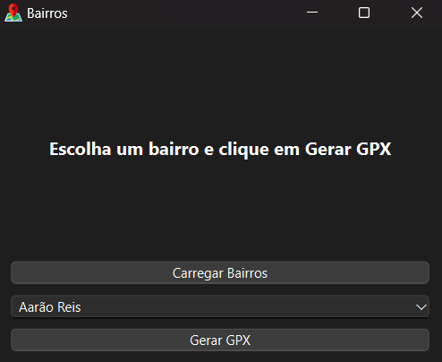

# Bairros
Ferramenta para gerar GPX de bairros de Belo Horizonte.



## Instalação
1. Clone o repositório:
```
git clone https://github.com/marcelochaves95/bairros.git
cd bairros
```
2. Instale as dependências necessárias:
```
pip install -r requirements.txt
```

## Uso
1. Navegue até a pasta do arquivo principal:
```
cd bairros
```

2. Execute o script principal:
```
python main.py
```

3. Siga os passos na interface:
- Carregue a lista de bairros.
- Selecione um bairro.
- Gere e salve o arquivo GPX correspondente.

## Requisitos
- Python 3.9 ou superior.
- Dependências listadas em `requirements.txt`.
